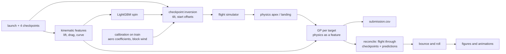

# Blind Carry: radar to rest

Predicting launch spin, apex and level landing for golf shots that a netted range can only track as far
as its 60 m net, then drawing the whole flight from launch to rest. Entry for the Inrange Student
Competition (Kaggle).

A 3-D flight model is calibrated on the training shots and inverted on each shot's four checkpoint
crossings; its prediction becomes a feature for a Gaussian process. Every prediction is then turned
back into a physically consistent trajectory with bounce and roll.

## Results

Honest 5-fold cross-validation on `train.csv`: every label-dependent step (aerodynamic calibration,
session wind, spin model, Gaussian process) is refitted inside each fold, so no validation label ever
reaches a prediction.

| Approach | Landing (m) | Apex (m) | Apex t (s) | Landing t (s) | Spin (rpm) |
|---|---|---|---|---|---|
| Train mean | 42.04 | 31.23 | 0.465 | 0.857 | 2036 |
| Ridge, degree 2 | 5.14 | 2.88 | 0.090 | 0.145 | 1019 |
| LightGBM | 5.37 | 3.11 | 0.084 | 0.138 | 718 |
| Gaussian process | 4.69 | 2.35 | 0.077 | 0.130 | 824 |
| Physics only | 6.06 | 3.30 | 0.094 | 0.201 | 718 |
| **Hybrid (final)** | **4.24** | **2.09** | **0.068** | **0.118** | **718** |

Median landing error is 3.1 m and the 90th percentile is 8.2 m. Holding out whole sessions, so no wind
was ever fitted for that day, landing error is 5.24 m against 5.53 m for the Gaussian process alone.

Ablations of the final model, same honest CV: without session wind 4.51 m; without the physics feature
4.69 m; without the fingerprint features 4.46 m, with spin error rising from 718 to 1,009 rpm. Feeding
the model the *true* launch spin gives 4.34 m, no better than the estimate — spin is not the bottleneck.

## The data is not included

Competition rules forbid redistributing it. Download `train.csv` and `test.csv` from the competition's
Data tab into `inrange-competition/` beside this README, or point the code at them:

```
export INRANGE_DATA_DIR=/path/to/the/csvs
```

## Setup

Python 3.12, with pinned versions in `requirements.txt`. No external data; every library is open
source. Optional extras for the notebook and MP4 animations are commented at the bottom of that file.

With [uv](https://docs.astral.sh/uv/):

```
uv venv .venv --python 3.12
uv pip install --python .venv/bin/python -r requirements.txt
source .venv/bin/activate
```

or with the standard library:

```
python3.12 -m venv .venv
source .venv/bin/activate
pip install -r requirements.txt
```

## Running it

Every command is run from this directory with `src` on the path:

```
export PYTHONPATH=src

python -m flight.calibration                         # ~2 min  → outputs/calibration.json, calibration_shots.csv
python -m experiments.physics_studies aerodynamics   # ~1 min  → outputs/aero_diag.csv
python -m modelling.pipeline --cv --submit           # ~4 min  → submissions/submission.csv + CV report
python -m experiments.ml_studies error_analysis      # ~1 min  → outputs/error_analysis.{csv,json}
python -m report.figures eda                         #         → figures/01–05
python -m report.figures results                     #         → figures/06–15
python -m report.animation                           # ~3 min  → figures/test_shot.gif, test_shots_mix.gif
```

Timings are for a desktop CPU; the cross-validation runs its five folds in parallel.

`python -m modelling.pipeline --submit` alone is enough to reproduce the submission. Other switches:
`--layer gp_residual|physics`, `--no-wind`, `--groups session` (leave-session-out CV), and the ablations
`--oracle-spin` and `--no-fingerprints`.

Further studies, none of them needed for the submission:

```
python -m experiments.ml_studies explore | baselines | neighbours | hybrid
python -m experiments.physics_studies inversion
```

`notebooks/inrange_ball_flight.ipynb` runs the whole pipeline on Kaggle from a clean session: it writes
each source module, calibrates, cross-validates, submits, analyses the errors, renders the figures and
animates a test shot.

## Approach

**Range frame.** The downrange heading is 28.3666° from +x, and the four checkpoint lines are fixed
planes at 10.8621 + 15k m along it, identical for every bay. There are four bays, one on an upper deck
(z = 4.125 m). `launch_x/y/z` is the bay's nominal spot: fitting the checkpoints back to t = 0 shows the
ball effectively starts ~0.66 m (≈13 ms) behind it. Every shot is modelled in a launch-relative frame
(downrange, lateral, height above the tee) and rotated back at the end; `landing_z` is the tee height.

**Physics.** Gravity, drag ½ρAC_D v², Magnus lift ½ρAC_L v² along ω̂ × v, spin decay, and a uniform wind
per hitting block. With spin factor S = rω/v, C_D = cd0 + cd1·S and C_L = cl_max·S/(S + s_half);
calibration gives cd0 0.185, cd1 0.235, cl_max 0.324, s_half 0.122, and negligible spin decay.
Integration is RK4 at dt = 0.01 s with every shot vectorised together, and checkpoint crossings, apex
(v_z = 0) and landing are interpolated inside the step.

**Calibration.** One sparse least-squares problem fits the global coefficients, per-shot nuisances
(spin-axis tilt, start offsets) and a wind vector for each of the 19 hitting blocks against every
measured point of the training shots — four checkpoints, apex and landing — with the launch-monitor spin
known. The block winds share a constant −3.5 m/s offset along the range that absorbs drag the model does
not capture; the spread between blocks is the weather.

**Inversion (test time).** A batched Levenberg–Marquardt MAP fit recovers spin-axis tilt and start
offsets from the checkpoints alone, with priors from the calibration and spin held at a LightGBM
estimate. Blocks never seen in calibration fall back to the mean wind, which carries that offset.

**Hybrid layer.** For each target, a Gaussian process with an ARD RBF kernel takes 12 launch and
checkpoint features plus that target's physics prediction, and learns how far to trust the physics for
each kind of shot. Physics as a *feature* beat fitting the GP to physics residuals and beat LightGBM
with physics features.

**Reconciliation and ground contact.** For display, per-shot drag and lift multipliers, tilt and offsets
are fitted so the simulated flight passes through the measured checkpoints *and* the submitted apex and
landing; across the test set the flights pass a median 0.95 m from the predicted landing. Impact follows
the crater model of Penner (2002), then ballistic hops with drag, then a closed-form roll under rolling
resistance plus grass drag.



## What the data shows

- The net sees 41% of the carry and 30% of the flight time; 96% of shots are still climbing at it and
  92% peak beyond it, so apex and landing are extrapolations.
- Effective lift and drag measured between the checkpoints correlate with launch spin at r = 0.84 and
  r = 0.82, which is why spin is recoverable at all.
- Train and test come from the same 11 sessions interleaved in time: a classifier separates them with
  AUC 0.56.
- Players hit runs with one club (lag-1 spin correlation 0.80). Neighbour-in-time features were tested
  and rejected: they improve spin but worsen positions, and would memorise the split.

## Error analysis

`experiments.ml_studies error_analysis` explains the out-of-fold errors and feeds figures 13–15.

- **What.** The worst decile curves twice as much as the rest (12.6° against 6.1° of spin-axis tilt),
  has 1.7× more unusual aerodynamics and carries further past the net, yet its spin error is *smaller*.
- **Why.** Regressing log relative error (error ÷ carry) on seven standardised factors, R² = 0.31: being
  unlike the training set is the largest effect (+38% per standard deviation), then carry beyond the net
  (+24%), curvature (+16%) and an unusual ball (+13%). Spin misestimate has no detectable effect.
- **When.** Sessions differ (Kruskal–Wallis p < 0.001, still p = 0.005 after adjusting for shot type).
  Apparent time-of-day and position-in-block effects vanish under that adjustment: they were club
  progression. Residuals of consecutive shots are independent.

## Layout

```
src/
├── data/
│   ├── dataset.py          loading, range and per-shot frames, hitting blocks, submission format
│   └── features.py         kinematic features: effective lift/drag between checkpoints
├── flight/
│   ├── simulator.py        batched RK4 flight model
│   ├── calibration.py      joint fit of aerodynamics, per-shot nuisances and block wind
│   ├── inversion.py        batched Levenberg–Marquardt, checkpoint inversion, reconciliation
│   └── ground.py           bounce and roll
├── modelling/
│   ├── evaluation.py       error components and composite proxy
│   └── pipeline.py         final hybrid model: honest CV and submission
├── experiments/
│   ├── ml_studies.py       explore, baselines, neighbours, hybrid variants, error_analysis
│   └── physics_studies.py  inversion variants, aerodynamic diagnostic
└── report/
    ├── style.py            figure styling
    ├── figures.py          figures 01–15
    └── animation.py        animated launch-to-rest trajectories

docs/kaggle_writeup.md      the competition writeup
figures/                    figures 01–15, animations, thumbnail
notebooks/                  the Kaggle notebook
outputs/                    calibrations, out-of-fold predictions, analysis tables (regenerated)
submissions/submission.csv  the submitted predictions
```

Names use British English (modelling, summarise, neighbour, colour).

## Caveats

- A few test shots launch more steeply (up to 37°) or hook harder than any training shot, so those
  predictions extrapolate — the regime the error analysis flags as worst.
- Session wind is fitted from training landings. It transfers here because train and test share
  sessions; a new range would need its own calibration or a weather feed.
- Turf constants for bounce and roll are generic range-grass values, not measured at this range.
- The aerodynamic anomaly used in the error analysis is measured after the fact from the full flight: a
  diagnostic, not a predictor.
- AI use is disclosed in the writeup.

## Reference

A. R. Penner, "The run of a golf ball", *Canadian Journal of Physics* 80 (2002) 931–940.
